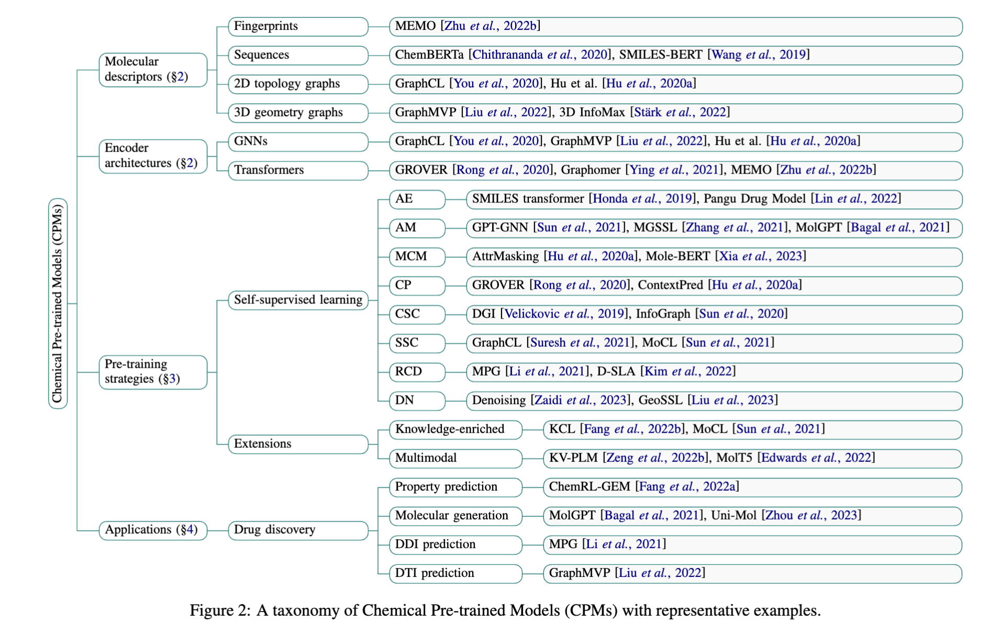

# 多模态分子数据库构建思路与计划
## 核心重点
1. **🎭 多模态**：包括一维（SMILES）、二维、空间结构，以及分子性质、靶点信息等；
2. **🧹 数据处理**：对分子进行标准化、去重化与筛选，形成多维度对齐的数据结构；
3. **📋 数据集格式**：建立统一的格式规范与数据清洗流程，确保数据的一致性与可扩展性；
4. **🤖 最终目的**：为AI分子训练做数据集，最终产出可直接喂给AI进行训练的金标数据。

## 开发环境与工具
1. Linux系统（先用macOS）
2. python、RDKit
3. PyMol
4. Open Babel（Gemini讲述）：
    ```
    Open Babel 是一个开源的化学信息学（Cheminformatics）工具箱。

    简单来说，它是化学数据领域的**“万能翻译官”**。

    在计算化学、分子模拟和药物发现领域，不同的软件和数据库通常使用完全不同的文件格式来描述分子结构。Open Babel 的核心作用就是在这些繁杂的格式之间进行转换和处理。

    以下是它的主要特点和用途：

    1. 核心功能：格式转换 (The "Translator")
    这是 Open Babel 最著名的功能。它支持 110 多种 化学文件格式之间的相互转换。

    输入/输出： 它可以读取一种格式（例如 PDB，蛋白质数据库格式），并将其保存为另一种格式（例如 Mol2 或 SMILES 字符串）。
    常见格式： SMILES, InChI, SDF, PDB, XYZ, Gaussian 输入/输出文件等。
    2. 开发者工具 (The Library)
    Open Babel 不仅仅是一个可以点击运行的软件，它更常作为一个库（Library） 被程序员调用。

    它是用 C++ 编写的。
    它提供了多种语言的接口（Bindings），最常用的是 Python（通常称为 Pybel）、Java、Perl 等。
    场景： 如果你在写一个 myplan 项目，目的是处理化学分子数据（比如建立一个药物分子数据库），你就可以在后台调用 Open Babel 来处理用户上传的分子文件。
    3. 其他功能
    除了转换格式，它还可以做很多化学相关的计算和处理：

    生成 3D 坐标： 将 2D 的分子结构（平面图）转化为合理的 3D 结构。
    搜索与过滤： 在大量分子文件中搜索包含特定子结构（Substructure）的分子。
    属性计算： 计算分子的分子量、氢键供体/受体数量等物理化学性质。
    添加/删除氢原子： 根据 pH 值自动为分子加氢或去氢。
    总结
    如果你是做化学、生物医药、材料科学相关科研或软件开发的，Open Babel 是一个几乎绕不开的基础工具。

    如果你的项目 myplan 是一个化学数据库管理系统： 你可以用 MySQL/MongoDB 存数据，然后用 Open Babel 来解析和清洗这些化学数据。
    ```
5. MySQL / MongoDB 数据库管理系统
6. Docker  
    常用 Docker 指令（备忘录）🔖 这几个命令足够你毕设用到毕业：
    - 查看正在运行的容器：
        ```
        docker ps
        ```
    - 停止服务（下班了，不想让它占内存）：
        ```
        docker-compose stop
        ```
        数据不会丢，只是暂停运行。
    - 重新启动：
        ```
        docker-compose start
        ```
    - 彻底拆除（毕设做完了，或者想重来）：
        ```
        docker-compose down
        ```
        注意：这会删除容器，但不会删除 mongo_data 文件夹里的数据（因为我们配置了 volumes）。如果你想连数据一起删，手动把文件夹删了就行。


## 🎯 目标
构建一个高质量、多模态的分子数据库平台，为分子生成与药物发现提供统一的数据支撑。通过系统化的数据清洗、标准化与特征提取，实现 SMILES、2D、3D 结构、理化性质及靶点信息的多模态融合，形成可直接用于模型训练与评估的**金标数据集**。该数据库的建立将为后续的分子生成、性质预测及靶点特异性研究提供坚实的数据基础，提升药物设计的智能化与科学性，加快新药研发进程。

## 可利用工具
### AI 工具
Gemini
### 现成生物分子数据库
1. 综合性小分子与生物活性数据库 (The "Big Two") 📚
这两个是数据量最大、最常用的，几乎包含所有公开的化学物质信息。
- PubChem (美国 NCBI 维护).
🔗 主页链接： https://pubchem.ncbi.nlm.nih.gov/
特点： 全球最大的免费化学数据库。包含分子结构、物理化学性质、生物活性数据等。数据非常全，但数据源杂，清洗难度较大。
- ChEMBL (欧洲 EBI 维护).
🔗 主页链接： https://www.ebi.ac.uk/chembl/.
特点： 专注于具有药物样性质的生物活性分子。它的数据主要是从科学文献中手动提取和整理的，质量比 PubChem 更高，非常适合用来做构效关系（SAR）分析和模型训练。
2. 虚拟筛选与分子对接数据库 (For Virtual Screening) 💻
如果你要跑分子对接（Docking）或寻找“可购买”的化合物，看这里。
- ZINC Database (ZINC15 / ZINC20).
🔗 主页链接： https://zinc.docking.org/ (ZINC15) 或 https://zinc20.docking.org/.
特点： 专门为虚拟筛选设计。它只收录商业可购买（Commercially Available）的化合物，并且提供现成的 3D 格式，你可以直接下载下来扔进对接软件里跑。
3. 蛋白质-配体结合亲和力数据库 (Gold Standards for Scoring) ⚖️
这类数据库不仅有结构，还有精确的结合力数值，是训练打分函数（Scoring Function）和亲和力预测模型的金标数据集。
- PDBbind-CN (复旦大学/上海科技大学维护).
🔗 主页链接： http://www.pdbbind.org.cn/.
特点： 这是一个精选集。它从 PDB 数据库中筛选出有明确结合力数据的复合物。它的 "Refined Set" 和 "Core Set" 是学术界评估分子对接算法性能的标准测试集。
- BindingDB.
🔗 主页链接： https://www.bindingdb.org/.
特点： 专注于结合亲和力数据的收集，数据量很大，包含大量从专利和文献中提取的数据。
4. 基础结构数据库 (The Foundation) 🏗️
所有上述数据库的源头，存储蛋白质和大分子的 3D 结构。
- RCSB PDB (Protein Data Bank).
🔗 主页链接： https://www.rcsb.org/.
特点： 生物大分子 3D 结构的唯一权威归档。如果你需要受体（蛋白质）的结构文件（.pdb），必须来这里。
5. 药物与临床信息数据库 💊
如果你关注已经上市的药物或正在临床试验的药物。
- DrugBank.
🔗 主页链接： https://go.drugbank.com/.
特点： 结合了详细的药物数据（化学、药理、药剂）和全面的药物靶标信息。做药物重定位（Drug Repurposing）必看。

## Version 1️⃣
开发环境：macOS
开发工具：python=3.12

**💡 思考**：按照这个要求，项目更像是数据仓库而非数据库，重点在于 python 部分的 ETL 过程。

## 计划：
### step 1. 🧪 先挑选一些具有代表性的生物分子，研究这些分子在上述数据库中存储形式和元素，并下载到本地先进行测试。

根据 Gemini 推荐：
```
样本清单（覆盖 5 类场景）

A. 小分子药物 - 经典基准 (The Classics, 10个)
测试目的：验证基础字段（MW, LogP）计算是否准确，数据能否与 PubChem/ChEMBL 对齐。

Aspirin (阿司匹林) - 药物设计的“Hello World”。
Paracetamol (扑热息痛) - 极其简单的结构。
Caffeine (咖啡因) - 含氮杂环的典型。
Ibuprofen (布洛芬) - 所有的布洛芬都有手性（R/S），看你的数据库能不能分清。
Metformin (二甲双胍) - 极小，氮含量极高。
Sildenafil (伟哥) - 稍复杂的商业药物。
Imatinib (伊马替尼/格列卫) - 激酶抑制剂的金标，分子较大。
Warfarin (华法林) - 著名的抗凝血药。
Dopamine (多巴胺) - 内源性小分子。
Glucose (葡萄糖) - 多羟基，立体化学极多，测试 SMILES 是否规范。
B. 复杂与大环分子 (The Stress Test, 10个)
测试目的：这是 RDKit 和 Open Babel 生成 3D 构象的噩梦。 验证你的 3D 生成流程会不会报错或卡死。
11. Paclitaxel (紫杉醇) - 结构极其复杂，巨大的刚性骨架。
12. Vancomycin (万古霉素) - 糖肽类抗生素，非常大，容易超出某些计算限制。
13. Cyclosporine A (环孢素) - 大环多肽，违反“类药五原则”（Ro5）。
14. Rapamycin (雷帕霉素) - 巨大的大环内酯。
15. Vitamin B12 (维生素B12) - 含有钴（Co）金属的大分子，测试金属处理能力。
16. Digoxin (地高辛) - 强心苷，含有糖基。
17. Amphotericin B (两性霉素B) - 多烯类抗生素。
18. Ivermectin (伊维菌素) - 复杂的十六元环。
19. Reserpine (利血平) - 复杂的生物碱。
20. Fullerene (C60, 富勒烯) - 全碳球体，非药物，但常用于测试图神经网络。

C. 特殊/边缘情况 (The Edge Cases, 10个)
测试目的：验证数据清洗（Sanitization）能力。
21. Cisplatin (顺铂) - 含铂金属（Pt），许多软件读不出来。
22. Ferrocene (二茂铁) - 夹心结构，3D 构象生成很难。
23. Sodium Chloride (NaCl) - 盐。你的数据库应该把它清洗掉，还是保留？
24. Water (H2O) - 溶剂。应该被过滤掉。
25. DMSO - 常见溶剂。
26. ATP - 带有高能磷酸键，电荷处理很麻烦。
27. Glutathione (谷胱甘肽) - 三肽，测试对氨基酸序列的支持。
28. Lipopolysaccharide (LPS片段) - 极性极大。
29. Benzene (苯) - 芳香性的基准。
30. Radical (某种自由基) - 测试对带未成对电子分子的处理。

D. 著名药物靶点 (Protein Targets, 10个)
测试目的：验证 PDB 数据解析能力，以及能否提取结合口袋信息。
31. 1ATP (PKA 激酶) - 经典激酶结构。
32. 3AID (HIV 蛋白酶) - 经典的基于结构药物设计案例。
33. 1CRN (Crambin) - 极小的蛋白质，用于测试解析速度。
34. 4HHB (血红蛋白) - 四聚体，测试多链处理能力。
35. 1MBN (肌红蛋白) - 第一个被解析的晶体结构。
36. 2RH1 (β2-肾上腺素受体) - GPCR（膜蛋白），药物设计的重点难点。
37. 6LU7 (SARS-CoV-2 Mpro) - 新冠主蛋白酶。
38. 3PTB (胰蛋白酶) - 经典的丝氨酸蛋白酶。
39. 1HSG (HIV 蛋白酶 + 配体) - 测试能否把配体从蛋白里“扣”出来。
40. 5P21 (Ras 蛋白) - 著名的肿瘤靶点。

E. 阴性/对照样本 (The Negatives, 10个)
测试目的：有些分子根本不是药，甚至有毒，数据库需要能标记它们（PAINS 筛选）。
41. Curcumin (姜黄素) - 著名的“泛测定干扰化合物”（PAINS），经常导致假阳性。
42. Doxorubicin (阿霉素) - 虽然是药，但有毒性。
43. KCN (氰化钾) - 剧毒无机物。
44. Ethanol (乙醇) - 既是溶剂也是药。
45. Glycerol (甘油) - 常见的 PDB 结晶杂质，必须能自动识别并剔除。
46. Polyethylene Glycol (PEG) - 聚合物，SMILES 很难写清楚。
47. Argon (氩气) - 惰性气体，有时出现在 PDB 里。
48. Heme (血红素) - 辅因子，不是普通的配体。
49. Ubiquitin (泛素) - 蛋白质修饰分子。
50. Alanine (丙氨酸) - 单个氨基酸。
```

贪多嚼不烂。如果你试图把这 7 个数据库全爬一遍，你的毕设就变成了“爬虫工程师”而不是“药物设计平台”。而且，DrugBank 需要审批授权，PDBbind 没有 API 只能下载压缩包，ZINC 数据量太大不适合单条爬取。

推荐的**黄金组合** (MVP V1.0) ✨
我们只选最权威且最好抓的 3 个库作为自动化的核心：
- PubChem (查户口): 拿最全的基础信息（SMILES, 分子量）。
- ChEMBL (查病历): 拿最规范的生物活性数据 (IC50/Ki) —— 这是药物设计的灵魂。
- RCSB PDB (查长相): 拿蛋白质的 3D 结构。

- PDBbind-CN: (稍后手动导入) 它是结合力的金标，但没有 API，需要你去官网下载压缩包，写另一个脚本解压读取。
- ZINC/DrugBank: (暂时放弃) ZINC 主要是为了买药（虚拟筛选），DrugBank 主要是临床信息，初期可以先不加，减轻工作量。

## 🔑 核心数据字段设计（面向AI训练）
### 1. 身份信息 (ID)
**作用**：分子的“身份证”，用于数据去重、跨库关联查询。
| 字段名          | 类型     | 示例值                          | 说明 & 软工视角                                                                 |
|-----------------|----------|---------------------------------|--------------------------------------------------------------------------------|
| `primary_name`  | String   | "Aspirin"                       | 分子通用名，便于人工识别                                                       |
| `std_inchi_key` | String   | "BSYNRYMUTXBXSQ-UHFFFAOYSA-N"   | 分子唯一哈希ID，**作为主键（Primary Key）**，防止重复插入数据                   |
| `source_ids`    | Object   | `{"pubchem_cid": 2244, "chembl_id": "CHEMBL25"}` | 外链ID，关联不同数据库的同源分子数据                                           |

### 2. 结构数据 (Structure) —— AI 输入特征 (Features X)
**作用**：描述分子空间形态，是AI模型的核心输入“原料”。
| 字段名          | 类型     | 示例值                          | 说明 & 软工视角                                                                 |
|-----------------|----------|---------------------------------|--------------------------------------------------------------------------------|
| `smiles`        | String   | "CC(=O)Oc1ccccc1C(=O)O"         | 一维分子结构序列，类比**NLP的文本句子**，适配Transformer等序列模型             |
| `mol_block_3d`  | String   | 含X/Y/Z坐标的文本块             | 三维分子坐标信息，类比**3D游戏的模型文件**，适配3D-CNN等空间结构模型            |

### 3. 理化性质 (Properties) —— 辅助特征 (Aux Features)
**作用**：分子的“基础属性面板”，由RDKit计算生成，用于数据筛选和模型特征补充。
| 字段名    | 类型    | 说明 & 直观理解                                                                 |
|-----------|---------|--------------------------------------------------------------------------------|
| `mw`      | Float   | 分子量 → 分子“大小/重量”，过大的分子难以成药                                   |
| `logp`    | Float   | 脂水分配系数 → 分子“油腻程度”，理想药物值通常<5（兼顾亲脂/亲水）                 |
| `hbd`     | Integer | 氢键供体数 → 分子“社交抓手”数量，影响与蛋白质的结合能力                         |
| `hba`     | Integer | 氢键受体数 → 同上                                                               |
| `tpsa`    | Float   | 极性表面积 → 分子“带电面积”，决定药物肠道吸收效率                               |
| `qed`     | Float   | 类药性打分 → 0-1的分数，越高代表分子“越像药”，用于初步筛选候选分子               |

### 4. 生物活性 (Activities) —— AI 预测目标 (Labels Y)
**作用**：模型训练的“标准答案”，用于计算预测误差（Loss Calculation）。
| 字段名          | 类型     | 示例值                          | 说明 & 直观理解                                                                 |
|-----------------|----------|---------------------------------|--------------------------------------------------------------------------------|
| `bio_targets`   | List     | `[{"target": "COX-2", "type": "IC50", "value": 10.5, "unit": "nM"}]` | 靶点活性列表，一个分子可作用于多个靶点 |
| - `target`      | String   | "COX-2"                         | 药物作用的蛋白质靶点                                                           |
| - `type`        | String   | "IC50"                          | 活性指标类型 → “杀伤力指标”，衡量药物效价                                       |
| - `value`       | Float    | 10.5                            | 活性数值 → 数值越小越好，代表“只需少量药物即可起效”                             |
| - `unit`        | String   | "nM"                            | 活性单位，统一量纲便于模型计算                                                 |

### step 2. 🔢 特征工程 (Feature Engineering) —— 把化学变成数学
- 目标： AI 模型看不懂字符串（SMILES）和文本（MolBlock），它们只吃数字（向量/矩阵）。我们需要把清洗好的数据转化成机器可读的 Tensor。
- 动作： 编写 4_vectorizer.py。
- 核心产出： 数据库中新增 features 字段，包含 分子指纹 (Fingerprint) 和 图邻接矩阵 (Graph Matrix)。

主要是通过论文，


根据这上面介绍的来。

## 🔑 三大核心数据库“人设”复习（钥匙开锁 analogy）
| 数据库   | 拟人化角色 | 核心提供数据 | 项目中作用 |
|----------|------------|--------------|------------|
| **PubChem** | 钥匙的**身份证登记处** | 1D/2D分子结构（SMILES）、基础理化性质（MW、LogP等） | 拿到分子的“标准长相”，完成基础身份建档与去重 |
| **ChEMBL** | 钥匙的**试用报告中心** | 生物活性数据（IC50、Ki）、临床阶段（Max Phase） | 获取分子的“杀伤力指标”，作为AI模型训练的Label |
| **RCSB PDB** | 锁与钥匙的**3D照相馆** | 蛋白质靶点（锁）的3D结构、小分子（钥匙）的结合姿态 | 拿到分子在真实空间的物理模型，支撑3D结构类AI模型训练 |

## 📏 核心筛选与标准化准则（金标数据集必备）
### 1. 类药潜力筛选：Lipinski 类药五原则 (Rule of Five) ⭐
**地位**：药物设计领域的“黄金法则”，AI制药数据预处理的**第一道过滤门槛**
**理论来源**：Lipinski, C. A., et al. (1997). *Experimental and computational approaches to estimate solubility and permeability in drug discovery and development settings*（引用量超3万次）
**核心特征**：基于4个关键理化性质，定义口服药物的基本潜力
| 特征指标 | 判定阈值 | 科学原理 | 对金标数据集的意义 |
|----------|----------|----------|--------------------|
| 分子量 (MW) | MW < 500 | 分子过大无法穿透细胞膜，难以被人体吸收 | 过滤掉“非药物潜质”的化学物质，确保数据聚焦**候选药物分子** |
| 脂水分配系数 (LogP) | LogP < 5 | 数值过高→分子过于亲油，易卡在细胞膜；数值过低→过于亲水，无法穿透细胞膜 | 筛选出“膜穿透性适中”的分子，符合口服药物的基本特性 |
| 氢键供体数 (HBD) | HBD ≤ 5 | 过多氢键供体导致分子水溶性过强，难以通过脂溶性生物膜 | 控制分子的“亲水-亲脂平衡”，提升成药可能性 |
| 氢键受体数 (HBA) | HBA ≤ 10 | 过多氢键受体增加分子极性，降低膜通透性 | 同上 |

### 2. 成药效率补充：Veber 准则 (Veber's Rules) 📊
**地位**：Lipinski 原则的重要补充，从**空间动力学**维度优化分子筛选
**理论来源**：Veber, D. F., et al. (2002). *Molecular properties that influence the oral bioavailability of drug candidates*
**核心特征**：聚焦分子“灵活性”与“极性”，解决“符合Lipinski却非好药”的问题
| 特征指标 | 判定阈值 | 科学原理 | 对金标数据集的意义 |
|----------|----------|----------|--------------------|
| 可旋转键数量 (Rotatable Bonds) | ≤ 10 | 可旋转键过多→分子构象过于灵活，与靶点蛋白结合时能量损耗大，药效减弱 | 筛选出构象稳定、与靶点结合效率高的分子 |
| 极性表面积 (TPSA) | ≤ 140 Ų | TPSA过大→分子极性过强，难以穿透血脑屏障（BBB）等生物膜 | 提升数据集对**中枢神经系统药物**等特殊品类的适配性 |

### 3. 活性数据标准化：pChEMBL Value 🎯
**地位**：生物活性数据的**工业级归一化标准**，直接决定AI模型训练精度
**理论来源**：Bento, A. P., et al. (2014). *The ChEMBL bioactivity database: an update*
**核心逻辑**：解决原始活性数据跨度大导致的模型难以收敛问题
- **原始数据痛点**：活性值（如IC50、Ki）范围可从 1nM 到 1,000,000nM，跨度达6个数量级
- **标准化处理公式**：
  $$pIC_{50} = -\log_{10}(IC_{50})$$
- **优势**：
  1.  将非线性的剂量-效应关系转化为线性关系，更契合AI模型的拟合逻辑
  2.  统一量纲，消除不同实验体系带来的数值偏差
- **对金标数据集的意义**：这是ChEMBL库中活性数据的首选指标，是保障模型训练稳定性的核心前提

### 4. 靶点结构质量：PDB 分辨率 (Resolution) 🔍
**地位**：衡量蛋白质靶点3D结构可靠性的**核心指标**，决定AI学习的“物理规律”是否准确
**理论来源**：Wlodawer, A., et al. (2008). *Protein crystallography for non-crystallographers*
**核心判定标准**（单位：Å，埃）：
| 分辨率范围 | 结构质量 | 数据价值 |
|------------|----------|----------|
| < 2.0 Å | 原子级精度 | **金标级别**，原子坐标清晰准确，可直接用于3D模型训练 |
| 2.0 Å - 3.0 Å | 中等精度 | 可用于粗略的构象分析，需谨慎使用 |
| > 3.0 Å | 低精度 | 仅能看到蛋白轮廓，原子位置偏差大，**不建议纳入训练集** |
- **对金标数据集的意义**：AI模型学习的是原子坐标与相互作用关系，低分辨率结构会传递错误物理信息，导致模型预测失真

### 5. 临床价值加权：临床阶段 (Max Phase) 🏆
**地位**：衡量分子“真实成药潜力”的**最终指标**，为数据赋予临床优先级权重
**理论来源**：Waring, M. J., et al. (2015). *An analysis of the attrition of drug candidates from four major pharmaceutical companies*
**核心分级**（max_phase 0-4）：
| 临床阶段 | 说明 | 数据权重 |
|----------|------|----------|
| Phase 4 | 已上市药物 | **最高权重**，经过人体临床试验验证，安全性和有效性有保障 |
| Phase 3 | 大规模临床试验阶段 | 高权重，成药概率高 |
| Phase 2 | 小规模临床试验阶段 | 中权重 |
| Phase 1 | 人体安全性试验阶段 | 中低权重 |
| Phase 0 | 临床前研究阶段 | 低权重，实验室有效但可能因毒性/代谢问题失败 |
- **对金标数据集的意义**：对不同临床阶段数据赋予差异化权重，能显著提升模型预测**真实临床药效**的能力

## 📊 AI生成分子评价四大核心指标（金标准）
**作用**：存入数据库作为AI生成分子的**打分表**，量化评估生成分子的质量与成药潜力

### 1. 分子基础质量指标 (Baseline Quality) 🎯
**地位**：生成分子的**准入门槛**，过滤无效、重复、无新意的产物
| 指标 | 定义 | 判定标准 | 对AI模型的意义 |
|------|------|----------|----------------|
| Validity（合法性） | 生成的SMILES字符串是否符合化学语法规则 | 可被RDKit/Open Babel成功解析为分子结构 | 筛除AI“胡编乱造”的无效分子 |
| Uniqueness（唯一性） | 生成分子的重复程度 | 相同分子在生成集中的出现频率 | 评估模型是否发生**模式崩溃**，避免反复生成同一分子 |
| Novelty（新颖性） | 生成分子是否存在于训练集/公开数据库 | 与PubChem/ChEMBL等库比对，无匹配记录 | 验证模型是否具备**创新能力**，而非简单“背诵”已有分子 |

### 2. 可合成性评价 (Synthesizability) 🔬
**地位**：目前工业界最关注的指标，解决“AI设计得出，实验室造不出”的痛点
| 指标 | 核心逻辑 | 评分规则 | 字段建议 |
|------|----------|----------|----------|
| SAscore（合成可及性分数） | 基于分子结构复杂度、官能团稀缺性等传统规则评估 | 1-10分，**分数越低合成越容易** | `analysis.sa_score` |
| RAscore（逆合成可及性分数） | 2021+ 新兴金标准，AI模拟逆合成路径，判断是否可通过商业原料制备 | 分数越高，可合成性越强 | `analysis.ra_score` |

### 3. 药用价值评价 (Druggability) 💊
**地位**：评估生成分子的“成药潜质”，筛选出真正像“药”的分子
| 指标 | 计算逻辑 | 判定标准 |
|------|----------|----------|
| QED（类药性定量打分） | 综合分子量、LogP、氢键供体/受体等理化性质加权计算 | 0-1分，**分数越高类药性越强** |
| Lipinski 违规数 | 统计违反Lipinski类药五原则的条数 | 0条最优，≤1条可接受，＞1条成药概率极低 |
| FCD（弗雷歇化学网络距离） | 工业界最新标准，通过深度学习比较生成分子群体与真实药物群体的特征空间距离 | 距离越近，生成分子越接近真实药物的分布特征 |

### 4. 靶点结合评价 (Binding Affinity) ⚖️
**地位**：针对特定靶点的定向评价，衡量分子与靶点蛋白的结合能力
| 指标 | 计算工具 | 判定标准 | 适用场景 |
|------|----------|----------|----------|
| Docking Score（对接得分） | AutoDock Vina / GNINA | 数值越负，分子与靶点蛋白的结合亲和力越强 | 针对特定靶点的分子生成任务（如新冠蛋白酶抑制剂） |
| RMSD（均方根偏差） | PyMol / RDKit | 将生成分子的3D结构与PDB实验结构重叠，偏差值越小结构越接近真实构象 | 生成分子3D结构准确性验证 |

### Step 3. 🔌 后端服务开发 (API Service) —— 软件工程的核心
- 目标： 一个数据库如果只能用 Python 脚本查，那叫“脚本”，不叫“系统”。我们需要做一个 Web 后端接口。
- 动作： 使用 FastAPI 编写接口。
- 核心产出： 实现 GET /molecule/{name} (查询) 和 POST /search/similarity (相似度搜索) 接口。
### Step 4. 🚀 数据扩容 (Scaling) —— 从 Demo 到 Big Data
- 目标： 50 个样本太少。既然代码跑通了，我们要把管道接入“大水管”。
- 动作： 从 ChEMBL 官网下载一份包含 10,000 个药物的 CSV，喂给你的 Pipeline。
- 核心产出： 数据库记录突破 1 万条，验证系统的并发能力和稳定性。
### Step 5. 🤖 模型验证 (Pilot Study) —— 证明数据的价值
- 目标： 训练一个简单的 PyTorch 模型，证明你的数据是真的能训练出东西的（闭环）。
- 动作： 简单的深度学习模型，预测 LogP 或 IC50。
- 核心产出： 一个训练 Loss 下降的曲线图（毕设论文里的关键截图）。


